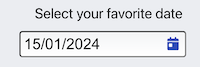
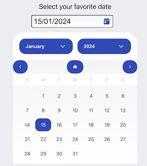
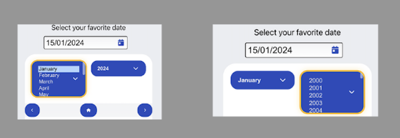
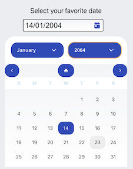
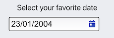

# React DatePicker Component

A flexible and customizable React DatePicker component with a built-in calendar for easy date selection.

## Example of DatePicker Component Usage

### Initial Input:

Location: ./screenshots/input/Input_initial.png
Description: Screenshot showcasing the initial appearance of the DatePicker input.



### Opened Calendar:

Location: ./screenshots/calendar/calendar_opened.png
Description: Screenshot illustrating the opened calendar for date selection.



### Month and Year Selection:

Location: ./screenshots/calendar/month_year_selected.png
Description: Screenshot displaying the selection of the month and year in the calendar.



### Day Selection:

Location: ./screenshots/calendar/day_selected.png
Description: Screenshot illustrating the selection of a specific day in the calendar.



### Rendered Input with Selected Date:

Location: ./screenshots/input/input_rendered.png
Description: Screenshot showing the final appearance of the input after date selection.



## Installation

### Prerequisites

Node.js v18 or higher
Please make sure you have the right versions and download both packages. You can verify this by using the following commands in your terminal:

### Check Node.js version
```bash
node --version
```
### Check npm version
```bash
npm --version
```

## To install the DatePicker component, use npm :

```bash
npm install plugin-datepicker --save 
```

### Usage

Import the DatePicker component in your React application and use it as follows:

```bash
import React from 'react';
import DatePicker from 'plugin-datepicker';

function App() {
  return (
    <div>
     <DatePicker
          type="text"
          minYear={1950}
          maxYear={2050}
          dateFormat={"dd/MM/yyyy"}
          language={"en-EN"}
          font="Roboto, sans-serif"
          fontSize="16px"
          customInputClass={{ className: "custom-input-class" }}
          id="inputDate"
          placeholder="dd/mm/yyyy"
        />
    </div>
  );
}

export default App;
```

## Props

- minYear (number, optional): The minimum allowed year for date selection.
- maxYear (number, optional): The maximum allowed year for date selection.
- customInputClass (string, optional): Additional custom class for styling.
- dateFormat (string, optional): The format in which the date should be displayed. Defaults to "yyyy/MM/dd".
- language (string, optional): The language for the date picker. Defaults to "en".
- errorClass (string, optional): Additional custom class for styling error messages.
- showCurrentDateOnMount (boolean, optional) = Use false for not see the current Date in input field
- showError (boolean, optional) = Use false for not see errors from DatePicker Default
- customStyles (object, optional): Custom styles for various elements.
  - calendarStyle (object): Styles for the calendar container.
  - monthSelectClass (object): Styles for the month select dropdown.
  - yearSelectClass (object): Styles for the year select dropdown.
  - buttonStyle (object): Styles for navigation buttons.
  - dateStyle (object): Styles for individual dates.
 

## Features

- Easy date selection with a built-in calendar.
- Customizable appearance with various styling options.
- Supports different date formats and languages.
- Validates and handles user input for accurate date selection.
- Accessible with keyboard navigation.

# Development

If you want to contribute or modify the DatePicker component, follow these steps:

- Clone the repository

```bash
https://github.com/VangitParis/plugin-datepicker.git
```

- Install dependencies:

```bash
cd plugin-datepicker
npm install
```

- Start the server

```bash
npm start
```

# Testing with Cypress

To run Cypress tests, use the following command:

```bash
npm run cypress:open
```

This will open the Cypress Test Runner, allowing you to run and interact with the tests.

# EsLint

This project uses ESLint for code linting. To run ESLint, use the following command:

```bash
npm run lint
```
